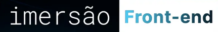
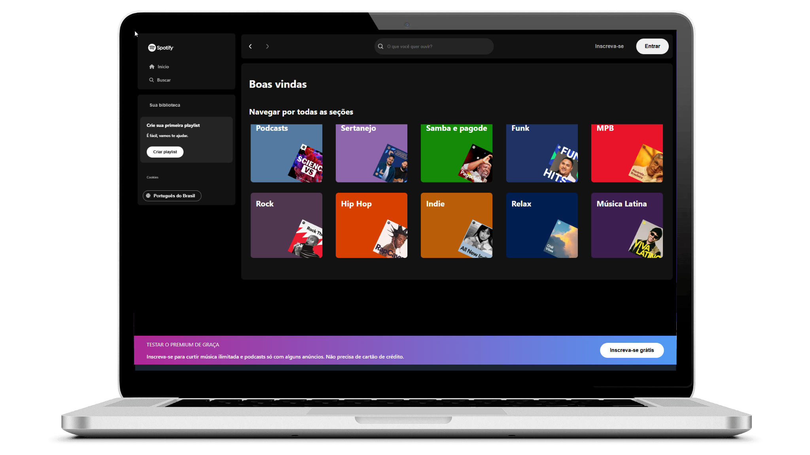
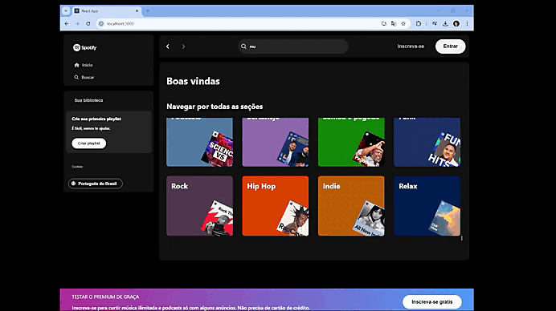

<!---------- Title/ Logo -------------->
<h1 align="center">
  
</h1>

<!-- ------- Ancoras --------------->
<p align="center">
  <a href="#-sobre">Sobre</a>&nbsp;&nbsp;&nbsp;|&nbsp;&nbsp;&nbsp;
  <a href="#-projeto">Projeto</a>&nbsp;&nbsp;&nbsp;|&nbsp;&nbsp;&nbsp;
  <a href="#-telas">Telas</a>&nbsp;&nbsp;&nbsp;|&nbsp;&nbsp;&nbsp;
  <a href="#-tecnologias">Tecnologias</a>&nbsp;&nbsp;&nbsp;|&nbsp;&nbsp;&nbsp;
  <a href="#-licença">Licença</a>
</p>

<!---------- Badges ----------------->  
<p align="center">
   
  
  
  
  <!----(4953b8)--BlueDark -->
  <!----(49AA26)--Green -->
  <!----(008ed6)--Blue -->
  <!----(3292a6)--BlueMedium-->
  <!----(015F43)--GreenMedium-->
</p>
<br>
<!---------- showcase  ----------------->  
<p align="center">
  
</p>

 <!----- Acess Deploy Demonstration-->
 <!--h5 align="center">
    🎬 Clique Aqui: &nbsp; <a href="https://event-platform-gold.vercel.app/">  Visualizar Demonstração </a> 
 </h5 -->


<!----- Description ------------------>
## 🔖 Sobre

 &nbsp;&nbsp;&nbsp;&nbsp;Este projeto é parte do evento que participei o **Imersão Front-end da Alura** da [Alura Cursos](https://www.alura.com.br/). &nbsp;&nbsp; Foi uma semana de maratona de estudos sobre desenvolvimento React-Front-End, em sua 2° edição. 
 
 &nbsp;&nbsp;&nbsp;&nbsp;O projeto denominado **Spotify-Imersao-Alura**, teve como objetivo criar uma aplicação Web front-end modelo de uma plataforma musica e podcast muito conhecida.
 &nbsp;&nbsp;O sistema **spotify-react**, é um modelo exemplificado de construção da principal plataforma: [Spotfy](https://open.spotify.com/) pelo painel admin principal fonte de cadastro de todo conteúdo da aplicação.
  
  <br>

  ## 💻 Projeto
  
 &nbsp;&nbsp;&nbsp;&nbsp;A Construção e desenvolvimento foi através de conceitos de arquitetura e plugins da linguagem **React.js**, utilizando dependências das bibliotecas **TypeScript**, aplicados a utilização de componentes aplicados a contextos.
   Durante a **Imersão Front-end da Alura**, foi possivel mergulhar em **HTML** e **CSS**, conhecer frameworks como Angular e React e desenvolver este projeto como exemplo prático para ampliar os conecimentos nestas técnologias.
  
 
<br>

 ###### **Evento :** Imersão Front-end da Alura 2ª Edição - [Alura Cursos](https://www.alura.com.br/)
 ###### **Instrutor :** Equipe Alura
<br>

<!----- Showcase Screens Shot------------------>
## 💻 **Telas**

<div align="center">



</div>
<br>
<br>

<!----- Pré Requisitos ---------------------------->

## 🚀 Tecnologias

- [HTML5](https://pt.wikipedia.org/wiki/HTML5) - Hyper Text Markup Language - linguagem de marcação de hipertexto.
- [React](https://reactjs.org/) -Biblioteca JavaScript para criação de Interfaces (Front-End).
- [TypeScript](https://www.typescriptlang.org/) - Conjunto da linguagem JavaScript com definições de tipo estático.
- [Node.js](https://nodejs.org/en/) - Ambiente de execução Javascript server-side.
- [VS Code](https://code.visualstudio.com/) - Editor de desenvolvimento de aplicações web.
- [Vercel](https://vercel.com/) - Plataforma voltada para a hospedagem de aplicações.

<br>

## 📝 Licença
<a href="https://opensource.org/licenses/MIT">
    
</a>

 &nbsp;&nbsp;&nbsp;&nbsp;Esse projeto está sob a licença MIT. Veja o arquivo [LICENSE](https://opensource.org/licenses/MIT) para mais detalhes.

 <br>

<!----- Configurations ---------------------------->
 ## 📌 Instruções : 

Para iniciar o Servidor da aplicação use o comando: **_npm run dev_** então acesse pelo navegador **_http://localhost:3000/_** 

<br>

## 📁 Como Baixar o Projeto

```bash
  # Clonar o repósitorio
  $ git clone https://github.com/alxlima/spotify-imersao-alura.git

  # Entrar no diretório
  $ cd c:/fontes/projetos/spotify-react

   # Instalar as dependências
  $ npm install
  
  # Iniciar o Projeto
  $ npm start
```
#
 Desenvolvido 🚀 por: ***_Alex Sandro da Silva lima_***


[](https://www.linkedin.com/in/alex-sandro-da-silva-lima-8b297839/) 
[](mailto:alex_lima2013@hotmail.com)

